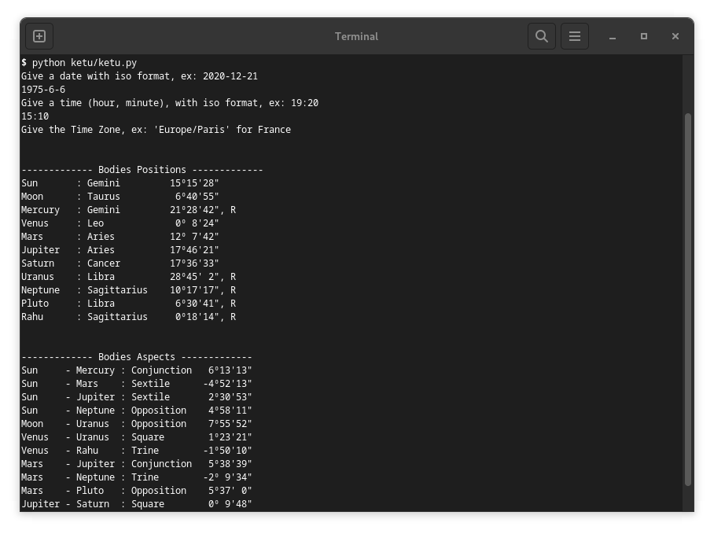

# ketu

Little library to compute positions of astronomical bodies (Sun, Moon, planets
and mean Node aka Rahu), generate time series and calendars based on planetary
aspects.

Need python 3.9+, pyswisseph: `pip install pyswisseph` and numpy: `pip install
numpy`

At the moment, compute bodies positions and aspects for a date.

Move to ketu directory, run `python ketu.py`  or `python test_app.py` for the first full moon AD :).

## TODO

+ find datetimes for beginning, end and exact aspect
  
+ find all aspects between two dates
